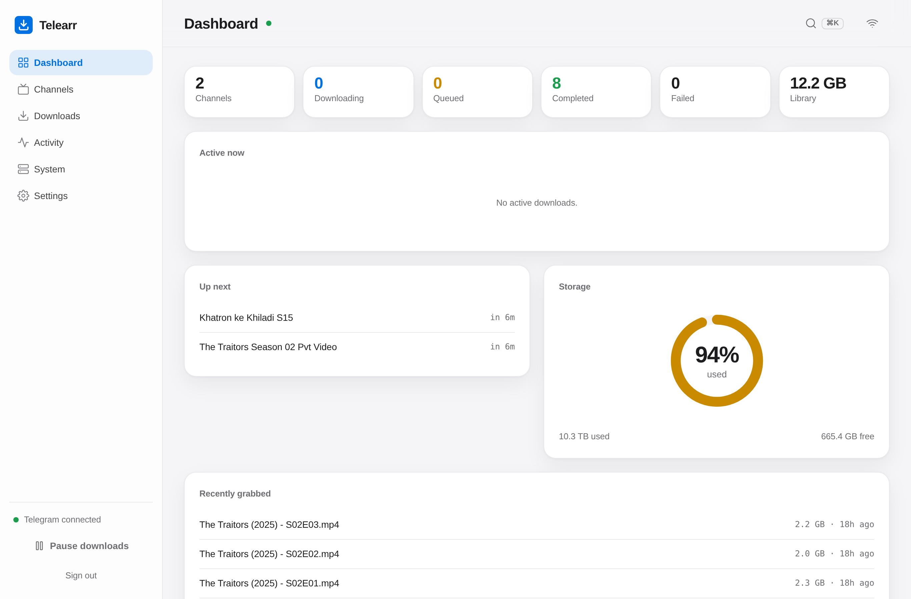
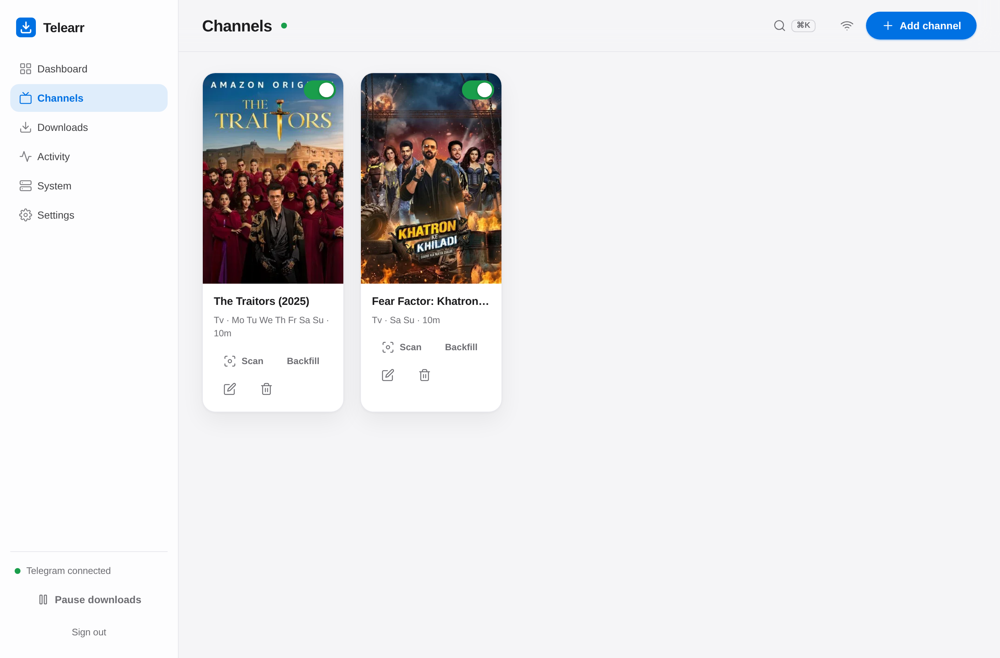
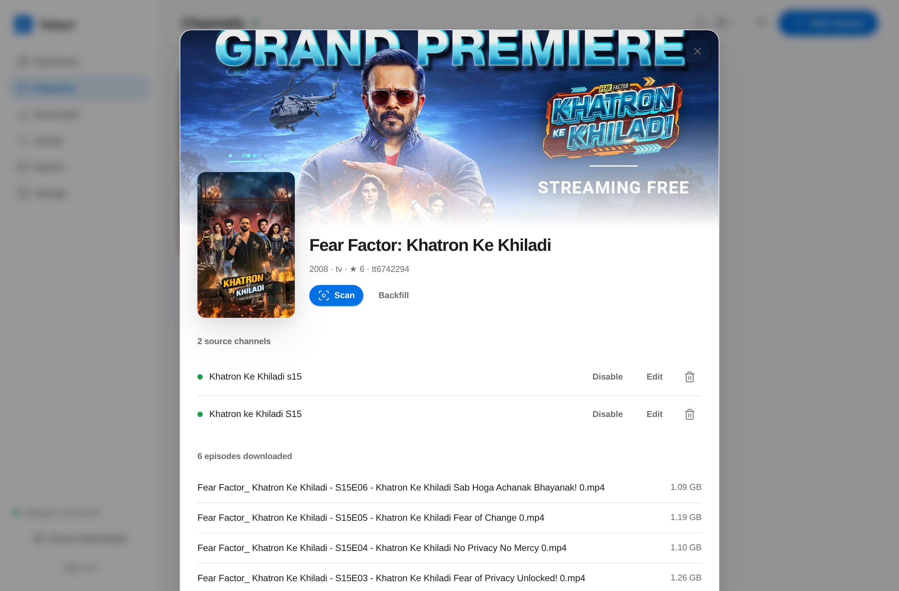
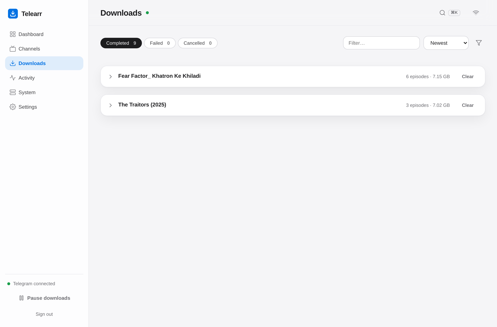
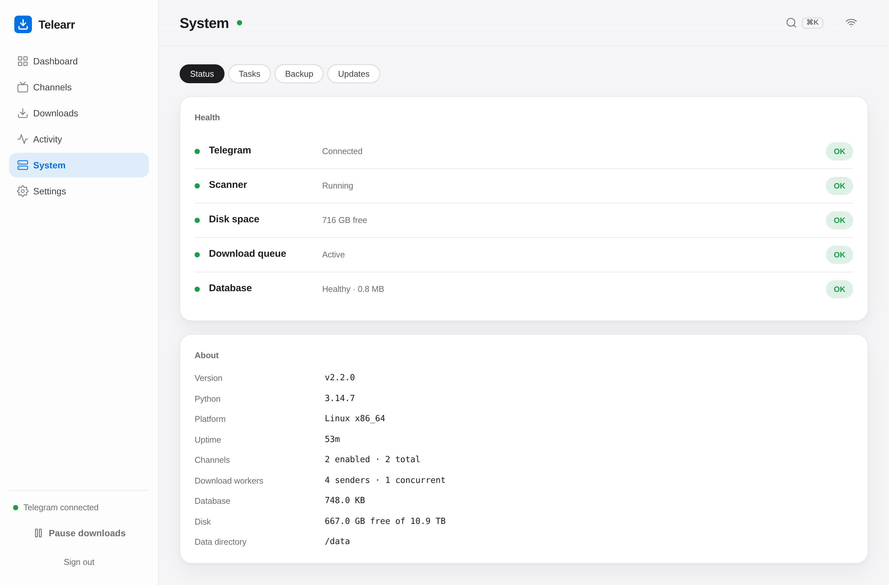
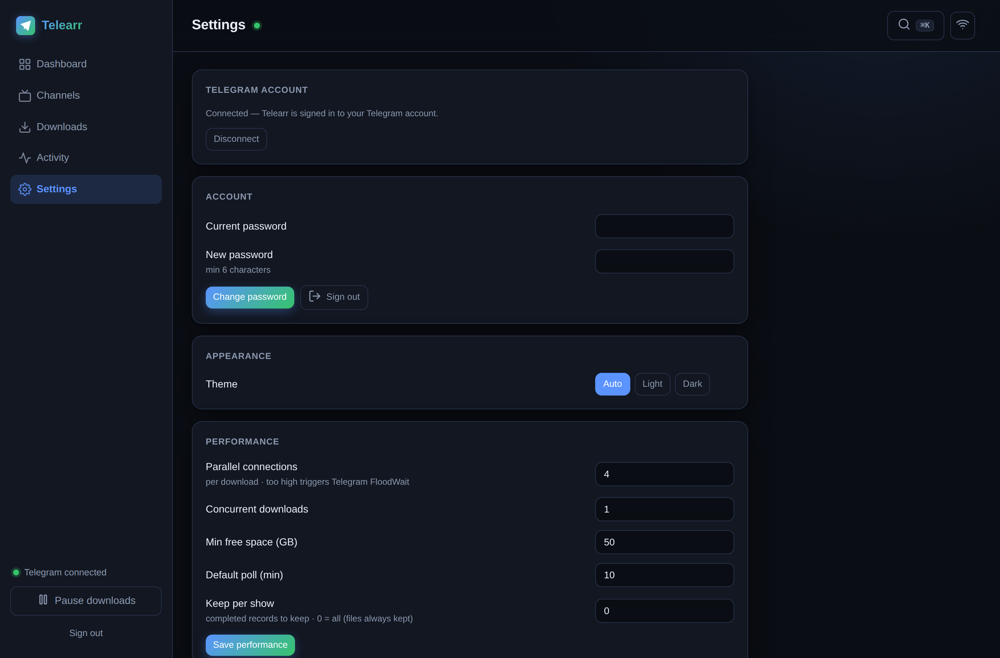
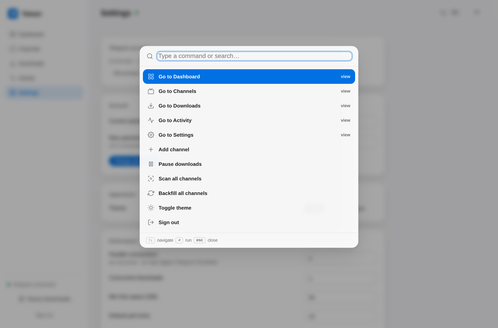
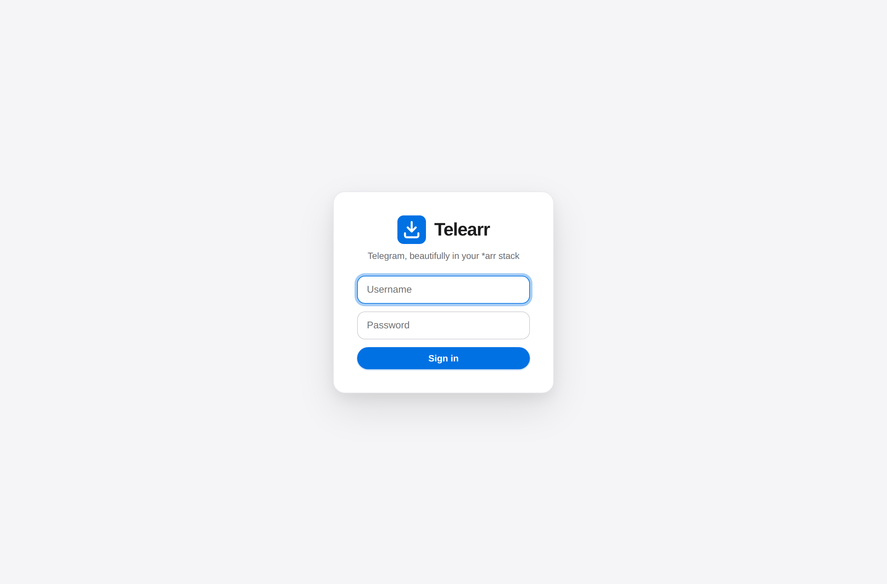
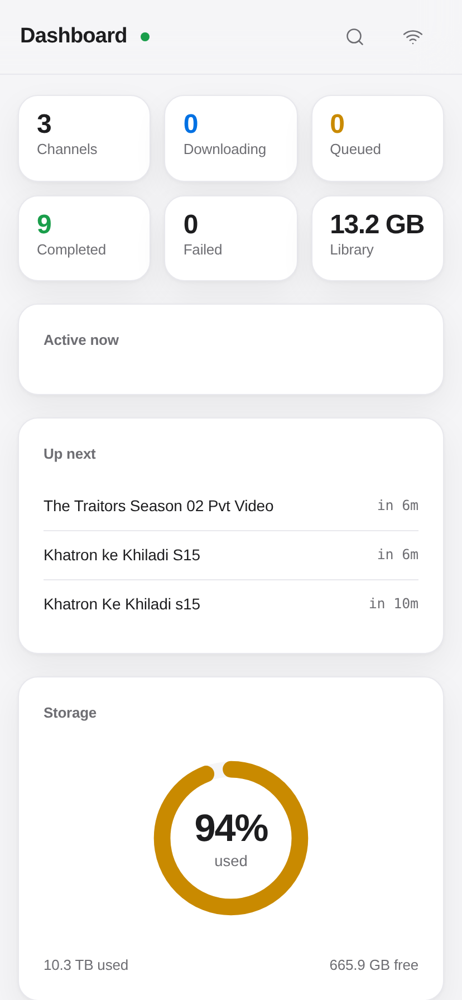

# Telearr

[](https://github.com/Wishaal/Telearr/actions/workflows/ci.yml)
[](LICENSE)
[](https://github.com/Wishaal/Telearr/releases)


**Bring Telegram into your \*arr stack.** Telearr watches Telegram channels,
auto-downloads the media they post into a clean, Plex-ready library, and exposes
those channels to Sonarr, Radarr and Prowlarr as if they were a usenet indexer
and download client.

Telearr is a self-hosted [FastAPI](https://fastapi.tiangolo.com/) +
[Telethon](https://docs.telethon.dev/) application (Python 3.13) that ships as a
single hardened, non-root Docker container.

---

## Why Telearr

Telegram is one of the largest, fastest and most under-used media sources for the
self-hosting world. The \*arr ecosystem (Sonarr, Radarr, Prowlarr) is brilliant at
automating usenet and torrents, but it has never had a first-class way to treat a
Telegram channel as a source. Telearr bridges that gap: it speaks the
Newznab indexer protocol and the SABnzbd download-client protocol, so your
existing \*arr apps can search, grab and import from Telegram exactly the way they
already do from a usenet provider — no new workflow to learn.

Use Telearr standalone with its own web UI, or wire it into your \*arr stack. Both
work, and both share the same fast downloader and library layout.

---

## What it does

- Polls the Telegram channels you add, on a schedule you control.
- Picks the **single largest file per episode** (channels often re-post the same
  episode in several qualities — you keep the best one).
- Downloads it fast over many parallel MTProto connections.
- Parses the filename/caption into `Show/Season NN/Show - SNNENN - Title.ext`.
- Routes **4K vs 1080p** into separate libraries automatically.
- Triggers a **targeted Plex refresh** so the episode shows up in seconds.
- Optionally fires a **webhook notification** on completion.

## Features

- **In-app Telegram sign-in** — connect your account from the browser: phone →
  login code → optional 2FA password, all in a guided wizard. No terminal, no
  `authorize.py`, no copying session strings.
- **Pick channels from your chat list** — Telearr reads the channels/groups your
  account already follows, so you select one from a list instead of hunting for IDs
  in web Telegram. You can still paste a `@username`, `t.me` link, or invite link,
  and Telearr joins it for you.
- **Poster library** — channels render as a poster wall using TMDB art (with an
  optional API key) and a keyless IMDb fallback, so the library looks like Plex, not
  a spreadsheet.
- **Hero detail drawer** — click a title for a full-bleed backdrop, synopsis,
  rating, and its recent downloads.
- **Real-time everything** — dashboard stats, download progress, and activity
  stream live over Server-Sent Events; no manual refresh.
- **Command palette (⌘K / Ctrl-K)** — jump to any page or action from the keyboard.
- **Telegram notifications** — completed downloads are pushed to your Telegram
  Saved Messages with the poster and an "Open in Plex" link.
- **Installable (PWA)** — add Telearr to your phone's home screen with an app icon
  and theme color.
- **System panel** — a Sonarr-style System area with **Status** (health checks +
  app/host info), **Tasks** (per-channel scan schedules with next-run times),
  **Backup** (one-click database + settings snapshots, download/restore), and
  **Updates** (installed vs latest GitHub release).
- **Web UI** — dashboard, channels, downloads, activity/log, and settings pages.
- **Mobile-friendly** — bottom navigation bar and a responsive layout.
- **Light / dark themes.**
- **Per-weekday scheduling** — each channel can run only on the days you choose.
- **Largest-file-per-episode dedup** — grouped by season/episode (or episode, or
  air date) so re-posts don't pile up.
- **4K vs 1080p auto-routing** — `2160p`/`UHD` files go to the 4K library, the rest
  to the 1080p library, per media kind (TV / movie / other).
- **Plex targeted refresh** — only the affected library section and path are
  refreshed, not the whole server.
- **Webhook notifications** — Discord/Slack-compatible JSON payload on each
  completed download.
- **History retention** — optionally keep only the newest N completed records per
  channel (files on disk are never touched).
- **Parallel multi-connection downloader** — a "FastTelethon"-style engine that
  borrows N exported senders and pwrites contiguous part-ranges into a
  preallocated file. With `cryptg` (AES-NI) installed the crypto is nearly free, so
  throughput scales roughly with the number of workers. If the fast path ever
  breaks (e.g. after a Telethon upgrade) it **automatically falls back** to
  Telethon's built-in sequential downloader, so the app keeps working.
- **Pause / resume** — pause the whole queue; interrupted downloads are re-queued
  and resumed on the next boot.
- **IMDb mapping picker** — search IMDb from the UI and pin a channel to a specific
  title so naming uses the canonical show name.

## \*arr integration

Telearr can plug straight into your existing automation stack:

- **As a Newznab indexer** — Telearr serves a Newznab-compatible API at
  `http://<host>:8790/api/newznab`. Add it to Prowlarr (or directly to Sonarr /
  Radarr) as a Newznab indexer and searches map onto your Telegram channels.
- **As a SABnzbd download client** — Telearr exposes a SABnzbd-compatible API on
  the same host and port. Add it to Sonarr/Radarr as a SABnzbd download client and
  grabs are handed to Telearr, which downloads from Telegram and drops the finished
  file where the \*arr app expects it for import.

The net effect: Sonarr/Radarr treat your Telegram channels as a usenet-like
source — search, grab, download, import — using the workflow you already run.

See **[docs/ARR_INTEGRATION.md](docs/ARR_INTEGRATION.md)** for the full setup guide
(URLs, API key, categories, and known limitations of this young integration), and
**[docs/ARCHITECTURE.md](docs/ARCHITECTURE.md)** for how it works internally.

> The \*arr integration is new. It works, but it is deliberately conservative and
> has known limitations — please read the integration doc before filing issues.

---

## Quick start

Requirements: Docker + Docker Compose, and Telegram API credentials from
<https://my.telegram.org>.

```bash
# 1. Configure
cp .env.example .env
$EDITOR .env          # set TG_API_ID, TG_API_HASH, TELEARR_SECRET_KEY, TELEARR_ADMIN_PASS

# 2. Build and start
docker compose up -d --build
```

Then open **http://\<host\>:8790**, log in with the admin credentials from your
`.env`, and click **Connect Telegram** — the in-app wizard walks you through phone
number → login code → (optional) 2FA password. No terminal step required.

Then **Add channel** (pick one from your Telegram chat list or paste a `@username` /
`t.me` / invite link), optionally map it to an IMDb title, and Telearr starts
watching it.

### Day-to-day

```bash
docker compose logs -f            # live logs
docker compose restart            # restart
docker compose up -d --build      # rebuild after changing code
docker compose down               # stop
```

---

## Prebuilt image (GHCR)

Every `v*.*.*` tag publishes a multi-arch image (amd64 + arm64) to the GitHub
Container Registry:

```
ghcr.io/wishaal/telearr:latest        # newest release
ghcr.io/wishaal/telearr:2.1.0         # pinned version
```

To use it instead of building locally, set the image in `docker-compose.yml`
(replace `build: .` with `image: ghcr.io/wishaal/telearr:latest`) and run
`docker compose up -d`.

## Configuration

Telearr is configured in two complementary places.

**`.env` (deploy-time, 12-factor)** — everything the container needs at boot. See
[`.env.example`](.env.example) for the full list. Key variables:

| Variable | Purpose | Default |
| --- | --- | --- |
| `TG_API_ID` / `TG_API_HASH` | Telegram API credentials | — (required) |
| `TELEARR_MEDIA_ROOT` | Host path bind-mounted to `/media` in the container | — (required) |
| `TELEARR_BIND_ADDR` | Host address the web UI binds to (`127.0.0.1` = local only) | `0.0.0.0` |
| `PUID` / `PGID` | UID/GID that owns downloaded files | `1000` |
| `TELEARR_TV_DIR` / `TELEARR_TV_DIR_4K` | TV libraries (1080p / 4K) | `/media/TvShows/…` |
| `TELEARR_MOVIES_DIR` / `TELEARR_MOVIES_DIR_4K` | Movie libraries (1080p / 4K) | `/media/Movies/…` |
| `TELEARR_OTHER_DIR` | Fallback library for unparsed media | `/media/Other` |
| `TELEARR_MIN_FREE_GB` | Refuse to start a download below this free space | `50` |
| `TELEARR_DL_WORKERS` | Parallel senders per file | `4` |
| `TELEARR_MAX_CONCURRENT` | Simultaneous downloads | `1` |
| `TELEARR_BIND_PORT` | Web/API port | `8790` |
| `TELEARR_SECRET_KEY` | Session-cookie signing key | — (set a strong random value) |
| `TELEARR_ADMIN_USER` / `TELEARR_ADMIN_PASS` | Seed admin login (first run only) | — |
| `PLEX_URL` / `PLEX_TOKEN` | Enable targeted Plex refresh | — (optional) |
| `TELEARR_NOTIFY_WEBHOOK` | Completion webhook URL | — (optional) |

**Settings UI (runtime)** — a subset of settings can be changed live from the
Settings page with no rebuild: download workers, max concurrent, min free GB,
progress interval, default poll interval, history retention, Plex URL/token, and
the notification webhook. These are stored in the database and override the `.env`
defaults. Secrets (Plex token) are write-only in the UI — the API only reports
whether they are set, never their value.

---

## Screenshots

Telearr wears an **Apple-inspired** design language — precision editorial calm
with generous white space, SF Pro typography, a single restrained blue accent,
purposeful radii, and softly restrained depth. Light and dark are both
first-class. Posters and artwork carry the colour; the interface gets out of
their way.

| Dashboard — live stats, storage donut, download-speed graph | Channels — TMDB/IMDb poster library |
| --- | --- |
|  |  |

| Channel detail — hero backdrop, episodes | Downloads — grouped, live progress |
| --- | --- |
|  |  |

| System — health, tasks, backups, updates | Settings |
| --- | --- |
|  |  |

| Command palette (⌘K) | Connect Telegram (in-app sign-in) |
| --- | --- |
|  |  |

| Mobile |
| --- |
|  |

---

## Security

- Telearr runs as an **unprivileged UID** (`PUID`/`PGID`) inside the container, not
  as root, so downloaded files are owned by your media user.
- Secrets (`TG_API_HASH`, `TELEARR_SECRET_KEY`, admin password, Plex token) belong in
  `.env` — which should be `0600` and **never committed**. `.env.example` is the only
  environment file in the repo.
- The web UI and API are protected by a bcrypt-hashed login and a signed session
  cookie, but the container publishes port `8790` on your LAN. **Do not expose it
  directly to the internet.** Put it behind a reverse proxy with TLS (and ideally an
  extra auth layer) if you need remote access.
- The Newznab/SABnzbd APIs are guarded by an API key. Treat that key like a
  password — anyone with it can enqueue downloads.

To report a vulnerability, see **[SECURITY.md](SECURITY.md)**.

---

## Contributing

Contributions are welcome. See **[CONTRIBUTING.md](CONTRIBUTING.md)** for local dev
setup, coding style, and the PR process, and
**[CODE_OF_CONDUCT.md](CODE_OF_CONDUCT.md)** for community expectations.

## License

Telearr is licensed under the **GNU General Public License v3.0** — matching the
\*arr ecosystem it integrates with. See [LICENSE](LICENSE) for the full text.
